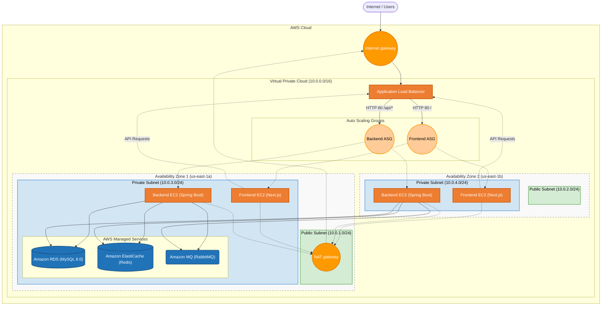

# 📦 Amazon-Like E-Commerce Platform (Phase 1: AWS Managed Services)

## 🚀 Phase 1 Overview
This branch (`phase-1-managed`) represents the **AWS Managed Services Phase** of a production-grade e-commerce application. 

Building upon the foundational manual EC2 deployment in Phase 0, this phase migrates the stateful data layer (Databases and Message Brokers) off of self-managed EC2 instances and onto AWS Managed Services (RDS, ElastiCache, Amazon MQ). 

This migration drastically reduces operational overhead, introduces automated backups, and improves the high-availability of the data tier without changing the underlying application code.

### 🏗 Architecture
*   **Frontend**: Next.js 14 (React) served via Node.js
*   **Backend**: Spring Boot 3.2 (Java 17) REST API
*   **Compute**: AWS EC2 Instances managed by Auto Scaling Groups (ASGs)
*   **Traffic routing**: AWS Application Load Balancer (ALB)
*   **Database layer**: 
    *   **Amazon RDS** (MySQL 8.0)
    *   **Amazon ElastiCache** (Redis)
    *   **Amazon MQ** (RabbitMQ)
*   **Security**: Strict AWS Security Group configurations and private subnets.




## 🛠 Managed Services Setup (Runbooks)

To update your infrastructure to use AWS Managed Services, execute these runbooks. These assume you have already completed the Phase 0 network foundation.

1. **[Network Configuration (`phase_0_network_config.md`)](./phase_0_network_config.md)**
   * VPC creation, Public/Private Subnets, Internet Gateways, and NAT Gateways (From Phase 0).
2. **[Security Groups (`phase_0_security_runbook.md`)](./phase_0_security_runbook.md)**
   * Defining strict ingress/egress rules between the different application tiers (From Phase 0).
3. **[Managed Data Layer Launch (`phase_0.5_managed_services_runbook.md`)](./phase_0.5_managed_services_runbook.md)**
   * Deploying Amazon RDS (MySQL), Amazon ElastiCache (Redis), and Amazon MQ (RabbitMQ) into private subnets.
4. **[Application Layer Launch (`phase_0.5_app_launch_runbook.md`)](./phase_0.5_app_launch_runbook.md)**
   * Updating Launch Templates and ASGs to point the Spring Boot backend to the newly provisioned Managed Service endpoints.

## 📂 Project Structure
```text
.
├── backend/                                   # Spring Boot Application Source Code
├── frontend/                                  # Next.js Application Source Code
├── ops/
│   └── scripts/                               # Helper setup scripts for EC2 instances
├── phase_0.5_app_launch_runbook.md            # Runbook: Updating App to use Managed Services
├── phase_0.5_managed_services_runbook.md      # Runbook: Launching RDS, ElastiCache, Amazon MQ
├── phase_0_network_config.md                  # Runbook: Setting up AWS VPC & Subnets
└── phase_0_security_runbook.md                # Runbook: Configuring Security Groups
```

---
*Created as the Managed Services iteration for a DevOps Reference Architecture journey.*
