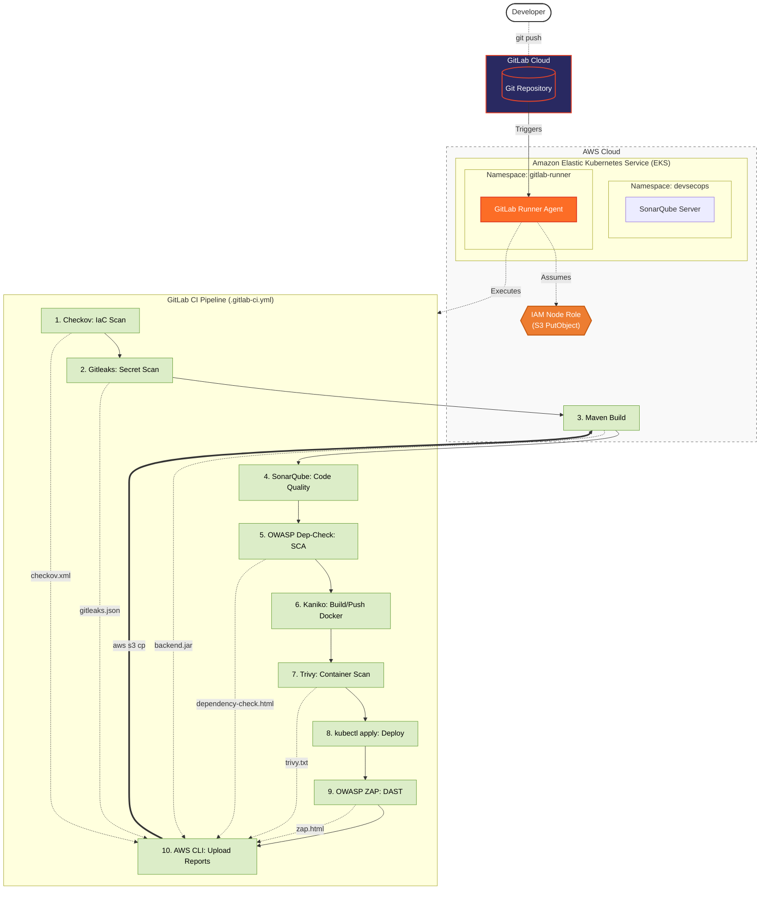

# 📦 Amazon-Like E-Commerce Platform (Phase 6d: Scan Reports & S3 Archiving)

## 🚀 Phase 6d Overview
This branch (`phase-6d-scanreports`) represents the **Compliance and Artifact Archiving** milestone of a production-grade e-commerce application. 

Building upon the Hybrid GitLab CI/CD pipeline from Phase 6c, this phase introduces a critical missing piece for enterprise compliance: **Permanent Record Keeping**. While CI/CD platforms usually delete job artifacts after a few days, security audits require historical proof of scans. 

To solve this, we use Terraform to provision a private Amazon S3 Bucket and configure IAM OIDC integration. The 10th stage of the GitLab pipeline now authenticates with AWS and pushes all vulnerability reports (IaC, Secrets, SCA, Container, DAST) and the compiled Java build artifact directly into long-term S3 storage before the pipeline finishes.

### 🛡 Archiving & Compliance Architecture
*   **Pipeline Orchestrator**: GitLab CI (Cloud SaaS)
*   **Storage Backend**: Amazon S3 (Private Bucket)
*   **Authentication**: AWS IAM Roles for Service Accounts (IRSA / OIDC via the EKS Node Group)
*   **Archived Artifacts**:
    *   `checkov-report.xml` (Terraform misconfigurations)
    *   `gitleaks-report.json` (Leaked secrets)
    *   `dependency-check.html` (Vulnerable open-source libraries)
    *   `trivy-report.txt` (Container OS vulnerabilities)
    *   `zap_report.html` (Dynamic runtime attacks)
    *   `backend.jar` (The compiled Java application)



## 🛠 S3 Archiving Setup

To provision the S3 bucket and execute the 10-stage pipeline:

1. **Provision Infrastructure**: Use Terraform in `ops/terraform/aws` to deploy the S3 bucket.
2. **Configure IAM**: Ensure your EKS Node Group IAM Role has `s3:PutObject` permissions.
3. **Set Variables**: Define the `$S3_BUCKET_NAME` variable in your GitLab CI/CD settings.
4. **Trigger Pipeline**: Push code to GitLab to watch the `upload_reports_job` securely archive your files.

## 📂 Project Structure
```text
.
├── .gitlab-ci.yml                 # 🦊 10-Stage Pipeline (Now includes `upload_reports_job`)
├── backend/                       # Source Code 
├── frontend/                      # Source Code
└── ops/
    ├── k8s/                  
    ├── scripts/
    └── terraform/
        └── aws/main.tf            # 🪣 IaC updated to provision the S3 Artifact Bucket
```

---
*Created as the S3 Artifact Archiving iteration for a DevOps Reference Architecture journey.*
