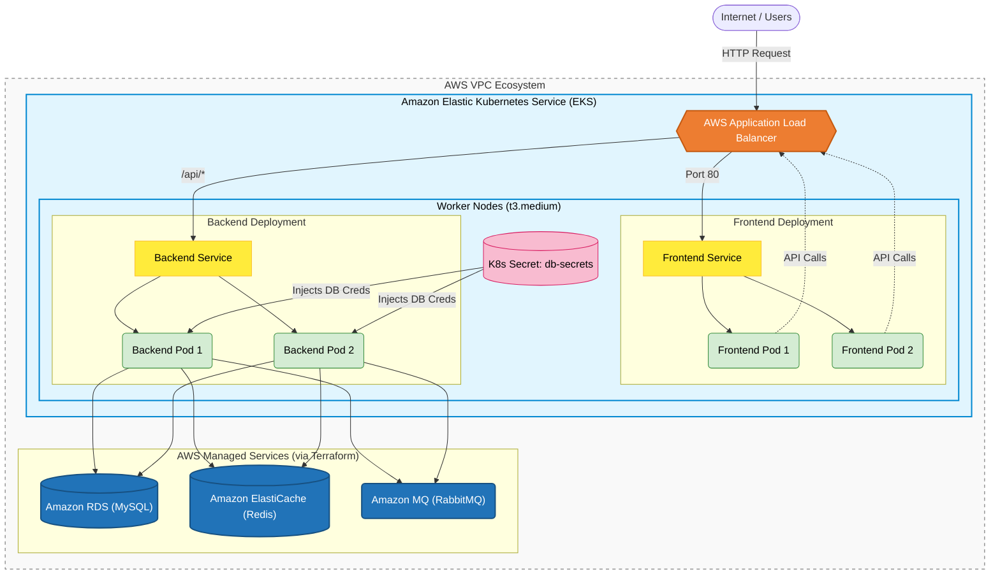

# 📦 Amazon-Like E-Commerce Platform (Phase 4: Kubernetes)

## 🚀 Phase 4 Overview
This branch (`phase-4-k8s`) represents the **Kubernetes Orchestration Phase** of a production-grade e-commerce application. 

Building upon the Docker containers from Phase 2 and the AWS Infrastructure provisioned in Phase 3, this phase deploys the stateless application components (Frontend & Backend) into **Amazon EKS (Elastic Kubernetes Service)**. 

By utilizing Kubernetes Deployments, Services, and Secrets, we achieve a highly available, self-healing, and easily scalable architecture that elegantly connects to our Terraform-provisioned Managed Data Layer.

### 🏗 EKS Architecture
*   **Compute Foundation**: AWS EKS Control Plane & Auto Scaling Node Groups
*   **Application Workloads**:
    *   **Frontend**: Next.js 14 replicas
    *   **Backend**: Spring Boot 3.2 replicas
*   **Traffic Ingress**: AWS Application Load Balancer (ALB) automatically provisioned by Kubernetes Services.
*   **Stateful Dependencies**: External AWS Managed Services (RDS, ElastiCache, Amazon MQ) securely injected via Kubernetes Secrets.



## 🛠 Kubernetes Deployment (Runbooks)

To deploy the application into the EKS cluster, follow the master runbook. *Note: You must have an active EKS cluster running from Phase 3.*

1. **[EKS Deployment Runbook (`phase_4_walkthrough.md`)](./phase_4_walkthrough.md)**
   * Fetching RDS credentials from Terraform and creating Kubernetes Secrets.
   * Building and pushing Docker images to AWS ECR.
   * Running the smart deployment scripts (`deploy_k8s.sh`).
2. **[Kubernetes Verification Tests (`phase_4_testcases.md`)](./phase_4_testcases.md)**
   * Checking Pod health, Service endpoints, and verifying full application connectivity.

## 📂 Project Structure
```text
.
├── backend/                  # Application code + deployment manifests
├── frontend/                 # Application code + deployment manifests
├── ops/
│   ├── k8s/                  # Raw Kubernetes Manifests (YAML)
│   │   ├── backend.yaml
│   │   └── frontend.yaml
│   ├── scripts/              # Helper Bash Automation
│   │   ├── deploy_k8s.sh           # Replaces ENV vars and deploys
│   │   └── update_k8s_secrets.sh   # syncs TF DB passwords -> K8s Secrets
│   └── terraform/            # Infrastructure State Foundation
├── phase_4_testcases.md      # Verification procedures for K8s deployments
└── phase_4_walkthrough.md    # Master Runbook for EKS orchestration
```

---
*Created as the Container Orchestration iteration for a DevOps Reference Architecture journey.*
