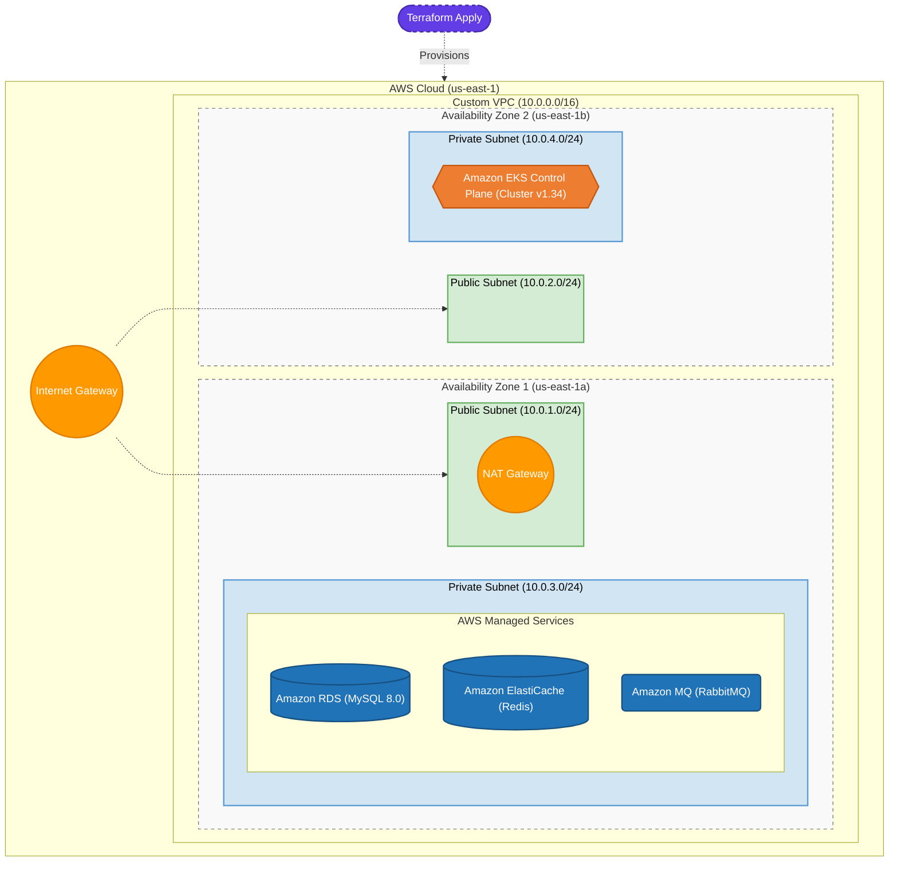

# 📦 Amazon-Like E-Commerce Platform (Phase 3: Terraform IaC)

## 🚀 Phase 3 Overview
This branch (`phase-3-terraform`) represents the **Infrastructure as Code (IaC)** evolution of a production-grade e-commerce application. 

Moving away from the manual AWS Console ClickOps approach of previous phases, this phase utilizes **Terraform** to treat infrastructure identically to application code. You can now reliably, repeatedly, and predictably provision the entire AWS backbone—including a custom VPC, Security Groups, Managed Databases (RDS, ElastiCache, Amazon MQ), and the foundation for a Kubernetes Control Plane (EKS).

This guarantees environment consistency across Development, Staging, and Production, drastically eliminates human error, and provides an auditable history of infrastructure changes via version control.

### 🏗 Provisioned Architecture
*   **Target Cloud**: Amazon Web Services (AWS)
*   **Networking**: Custom VPC (`10.0.0.0/16`) stretching across 2 Availability Zones.
*   **Subnets**: 
    *   2 Public Subnets (For Load Balancers & NAT Gateways)
    *   2 Private Subnets (For Compute, EKS Nodes, and Databases)
*   **Stateful Data Layer**: 
    *   **Amazon RDS** (MySQL 8.0)
    *   **Amazon ElastiCache** (Redis)
    *   **Amazon MQ** (RabbitMQ)
*   **Compute Foundation**: AWS EKS (Elastic Kubernetes Service) Control Plane (`v1.34`)



## 🛠 Infrastructure Setup (Runbooks)

To automatically provision this production-grade environment, follow the Phase 3 master runbook.

1. **[Terraform & Infrastructure Deployment Runbook (`phase_3_walkthrough.md`)](./phase_3_walkthrough.md)**
   * Bootstrapping the S3 backend state.
   * Executing the `terraform plan` and `terraform apply` workflow.
2. **[Infrastructure Verification Tests (`phase_3_testcases.md`)](./phase_3_testcases.md)**
   * Instructions on how to use the generated output endpoints to verify connectivity to your new databases and EKS cluster.

## 📂 Project Structure
```text
.
├── backend/                  # Spring Boot Application Source Code
├── frontend/                 # Next.js Application Source Code
├── ops/
│   ├── scripts/
│   │   └── setup_tf_state.sh # Bash helper to bootstrap the Terraform S3 remote backend
│   └── terraform/
│       └── aws/              # The Infrastructure configuration
│           └── main.tf       # Core IaC defining VPC, RDS, EKS, etc.
├── phase_3_testcases.md      # Verification procedures for provisioned outputs
└── phase_3_walkthrough.md    # Master Runbook for Terraform deployment
```

---
*Created as the Infrastructure as Code iteration for a DevOps Reference Architecture journey.*
