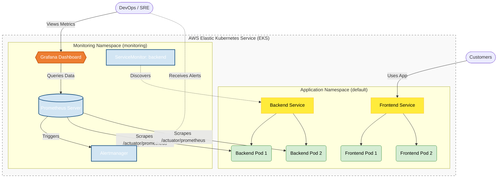

# 📦 Amazon-Like E-Commerce Platform (Phase 4.5: Observability)

## 🚀 Phase 4.5 Overview
This branch (`phase-4.5-observability`) introduces **"Eyes on Glass" Observability** to our Kubernetes application using the **Kube Prometheus Stack**. 

Building upon the EKS deployments from Phase 4, this phase implements an industry-standard monitoring and alerting foundation. By deploying Prometheus to scrape metrics and Grafana to visualize them, we gain critical real-time insights into exactly how the Java backend and Node.js frontend perform under load.

This transition from "blindly running" code to actively monitoring resource consumption (CPU/Memory) and application health (Request Latency/Throughput) is a crucial step towards production readiness.

### 🏗 Observability Architecture
*   **Orchestrator**: Helm (Kubernetes Package Manager)
*   **Metrics Engine**: **Prometheus** (Time-series database and scraper)
*   **Visualization**: **Grafana** (Dashboards for JVM and Node.js metrics)
*   **Alerting**: Alertmanager (Routing critical system alerts)
*   **Target Selection**: `ServiceMonitor` Custom Resource Definitions (CRDs) actively discovering application endpoints (`/actuator/prometheus`).



## 🔭 Monitoring Setup (Runbooks)

To easily deploy the Observability Stack onto your existing EKS cluster, follow the Phase 4.5 Runbook.

1. **[Observability Deployment Runbook (`phase_4.5_walkthrough.md`)](./phase_4.5_walkthrough.md)**
   * Using Helm to install the `kube-prometheus-stack`.
   * Configuring the `ServiceMonitor` to discover the Spring Boot application.
   * Accessing Grafana and importing standard JVM tracking dashboards.
2. **[Observability Verification Tests (`phase_4.5_testcases.md`)](./phase_4.5_testcases.md)**
   * Validating that metrics are successfully ingested.
   * Simulating traffic to observe live Grafana graph spikes.

## 📂 Project Structure
```text
.
├── backend/                  # Application code (exports /actuator/prometheus)
├── frontend/                 # Application code
├── ops/
│   ├── k8s/
│   │   ├── backend.yaml      # Includes annotations for Prometheus scraping
│   │   └── monitoring/       # 📊 Observability Configuration
│   │       ├── backend-monitor.yaml    # ServiceMonitor for Backend
│   │       └── prometheus-values.yaml  # Custom Helm overrides for the Stack
│   └── scripts/
│       └── ...               # Deployment scripts from previous phases
├── phase_4.5_testcases.md    # Verification procedures for ingested metrics
└── phase_4.5_walkthrough.md  # Master Runbook for Helm/Prometheus installation
```

---
*Created as the Observability iteration for a DevOps Reference Architecture journey.*
