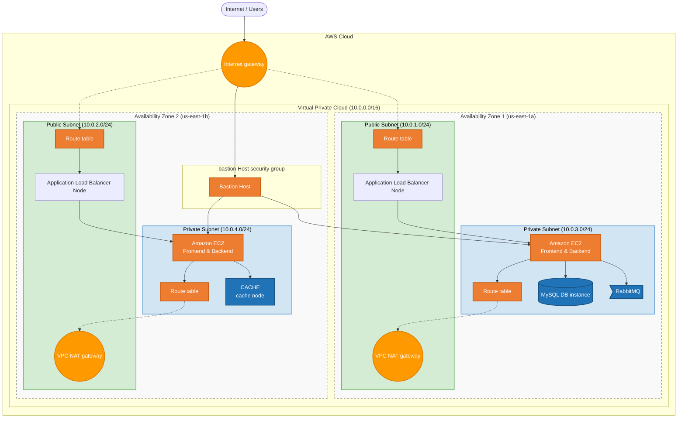

# 📦 Amazon-Like E-Commerce Platform (Foundation: AWS EC2 ClickOps)

## 🚀 Phase 0 Overview
This branch (`phase-0-ec2`) represents the **Foundational Infrastructure Phase** of a production-grade e-commerce application. 

Instead of jumping straight to Kubernetes and automation, this phase focuses on understanding the underlying AWS primitives by manually building a robust, highly-available architecture using **AWS Console ClickOps and Auto Scaling Groups (ASGs)**.

This establishes a baseline for understanding VPCs, Security Groups, IAM roles, and Load Balancing before introducing infrastructure-as-code and orchestration in later phases.

### 🏗 Architecture
*   **Frontend**: Next.js 14 (React) served via Node.js
*   **Backend**: Spring Boot 3.2 (Java 17) REST API
*   **Compute**: AWS EC2 Instances managed by Auto Scaling Groups (ASGs)
*   **Traffic routing**: AWS Application Load Balancer (ALB)
*   **Database layer**: MySQL 8.0, Redis (Session/Cache), RabbitMQ (Messaging)
*   **Security**: Strict AWS Security Group configurations and private subnets.




## 🛠 Foundational Setup (Runbooks)

To deploy this infrastructure from scratch, execute the following runbooks in order. These contain step-by-step instructions and the required User Data bootstrap scripts for the EC2 instances.

1. **[Network Configuration (`phase_0_network_config.md`)](./phase_0_network_config.md)**
   * VPC creation, Public/Private Subnets, Internet Gateways, and NAT Gateways.
2. **[Security Groups (`phase_0_security_runbook.md`)](./phase_0_security_runbook.md)**
   * Defining strict ingress/egress rules between the different application tiers (ALB -> Frontend -> Backend -> Data layer).
3. **[Data Layer Launch (`phase_0_data_launch_runbook.md`)](./phase_0_data_launch_runbook.md)**
   * Deploying self-managed MySQL, Redis, and RabbitMQ EC2 instances into private subnets.
4. **[Application Layer Launch (`phase_0_app_launch_runbook.md`)](./phase_0_app_launch_runbook.md)**
   * Creating Launch Templates with User Data scripts.
   * Configuring Target Groups and Application Load Balancers.
   * Deploying the Frontend and Backend Auto Scaling Groups.

## 📂 Project Structure
```text
.
├── backend/                        # Spring Boot Application Source Code
├── frontend/                       # Next.js Application Source Code
├── ops/
│   ├── docker/                     # Basic Dockerfiles (Preparation for future phases)
│   └── scripts/                    # Helper setup scripts for EC2 instances
├── phase_0_app_launch_runbook.md   # Runbook: Launching Frontend/Backend ASGs
├── phase_0_data_launch_runbook.md  # Runbook: Launching Databases on EC2
├── phase_0_network_config.md       # Runbook: Setting up AWS VPC & Subnets
├── phase_0_security_runbook.md     # Runbook: Configuring Security Groups
└── docker-compose.yml              # Local orchestration for testing the code
```

## ⚡ Local Development

While this phase focuses on manual AWS deployment, you can spin up the application stack locally for development and testing using Docker Compose:

```bash
docker-compose up -d --build
```
*   **Frontend**: [http://localhost:3000](http://localhost:3000)
*   **Backend API**: [http://localhost:8080](http://localhost:8080)

---
*Created as the baseline infrastructure for a DevOps Reference Architecture journey.*
