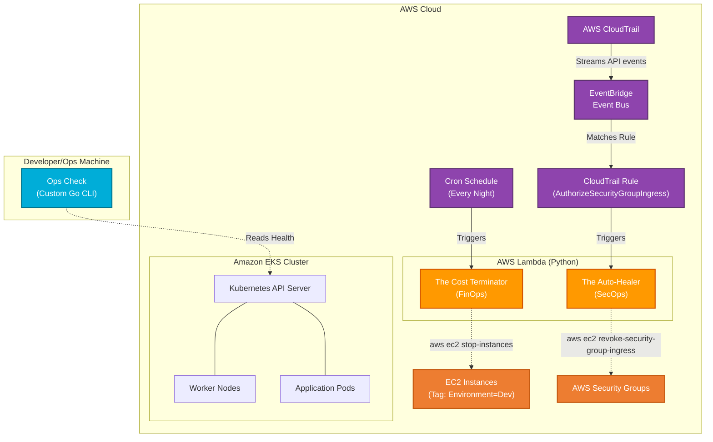

# 📦 Amazon-Like E-Commerce Platform (Phase 7: Senior Automation & Tooling)

## 🚀 Phase 7 Overview
This branch (`phase-7-automation`) represents a massive leap forward into **Senior-Level Cloud Automation**. 

Moving beyond standard CI/CD pipelines, this phase focuses on Day-2 Operations (Day-2 Ops) by implementing intelligent, event-driven automation using **AWS Lambda (Python)** and custom developer tooling using **Go**.

These tools actively monitor, optimize, and heal the AWS environment without human intervention, ensuring the infrastructure remains cost-effective, secure, and highly observable.

### 🤖 Automation Architecture
1. **The Cost Terminator (FinOps Automation)**
   * **Technology**: Python, AWS Lambda, Amazon EventBridge.
   * **Purpose**: Automatically scans the AWS environment for Dev/Staging EC2 instances and shuts them down during non-business hours to drastically reduce compute costs.
   * **Trigger**: Nightly EventBridge Cron Schedule.

2. **The Auto-Healer (SecOps Automation)**
   * **Technology**: Python, AWS Lambda, AWS CloudTrail, Amazon EventBridge.
   * **Purpose**: Provides real-time event-driven security remediation. If an engineer accidentally opens a Security Group port (e.g., SSH port 22) to the world (`0.0.0.0/0`), EventBridge detects the CloudTrail API call and triggers the Auto-Healer Lambda to instantly revoke the insecure rule.

3. **Ops Check (Custom Kubernetes CLI)**
   * **Technology**: Go (Golang), Kubernetes client-go.
   * **Purpose**: A lightning-fast, compiled command-line interface (CLI) tool that interacts directly with the EKS API server to summarize cluster health (Node readiness, Pod statuses) without needing to parse complex `kubectl` JSON/YAML outputs.



## 🛠 Automation Setup (Runbooks)

To execute the Python automation logic locally, compile the Go CLI, and deploy the EventBridge rules via Terraform, follow the Phase 7 Execution Guide.

1. **[Senior Automation Walkthrough (`phase_7_walkthrough.md`)](./phase_7_walkthrough.md)**
   * **FinOps**: Running the Cost Optimizer locally to test dry-run scaling, and manually tagging EC2 target resources.
   * **SecOps**: Injecting synthetic malicious CloudTrail events to test the Auto-Healer's revocation response.
   * **Custom Tooling**: Compiling and running the `ops-check` Go binary against your configured `~/.kube/config`.
   * **Deployment**: Selectively applying the automation Lambda infrastructure using Terraform targeting.

## 📂 Project Structure
```text
.
├── backend/                       # Source Code 
├── frontend/                      # Source Code
├── ops/
│   ├── cli/
│   │   └── ops-check/             # 🐹 Custom Go CLI tool for K8s health checks
│   ├── k8s/                       # Kubernetes App Manifests
│   ├── lambda/
│   │   ├── auto_healer/           # 🛡️ Python script for SecOps remediation
│   │   └── cost_optimizer/        # 💰 Python script for nightly FinOps scaling
│   ├── scripts/                   # Bootstrapping shell scripts
│   └── terraform/
│       └── aws/                   # 🪣 IaC updated to provision Lambdas and EventBridge
└── phase_7_walkthrough.md         # Master Runbook for compiling, testing, and applying automation
```

---
*Created as the Senior Automation & Event-Driven Operations iteration for a DevOps Reference Architecture journey.*
