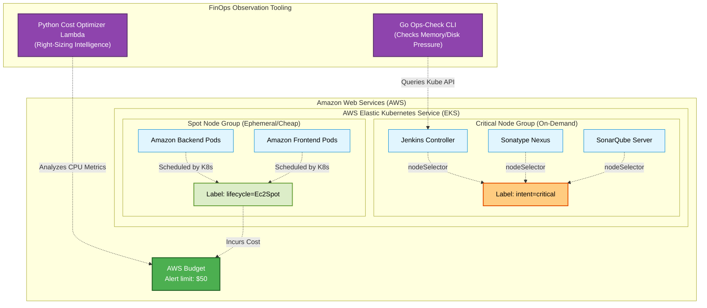

# 📦 Amazon-Like E-Commerce Platform (Phase 8: Advanced FinOps & Optimization)

## 🚀 Phase 8 Overview
This branch (`phase-8-finops`) represents the **Advanced Financial Operations (FinOps) and Optimization** milestone of our production-grade e-commerce application. 

As cloud infrastructure scales, costs can rapidly spiral out of control. This phase focuses entirely on cost reduction, workload optimization, and budget safety using a combination of Terraform infrastructure changes and Kubernetes scheduling intelligence.

By splitting our single monolithic EKS Node Group into a **Hybrid Architecture** (combining reliable On-Demand "Critical" nodes with cheap, ephemeral "Spot" nodes) and pinning our stateful applications to the critical tier, we dramatically lower our monthly AWS bill without sacrificing the stability of our CI/CD toolchain.

### 💸 FinOps Architecture & Features
1. **Hybrid EKS Node Groups (Spot + On-Demand)**
   * **Technology**: AWS EKS, EC2 Spot Instances, Terraform.
   * **Purpose**: Provisions a "Critical" Node Group (On-Demand) for stable databases and CI/CD tools, alongside a "Spot" Node Group (excess AWS capacity at up to 90% discount) for stateless application replicas.
2. **Intelligent Kubernetes Scheduling**
   * **Technology**: Kubernetes `nodeSelector` and `nodeAffinity`.
   * **Purpose**: Modifies the `jenkins.yaml`, `nexus.yaml`, and `sonarqube.yaml` manifests to explicitly bind these stateful applications to the `intent=critical` nodes, preventing them from being evicted when AWS reclaims Spot instances.
3. **Automated Cost Protection (AWS Budgets)**
   * **Technology**: AWS Budgets (via Terraform).
   * **Purpose**: Acts as a financial safety net native to AWS. If the projected monthly cost of the environment exceeds the defined limit ($50), an alert is immediately triggered.
4. **Right-Sizing AI & Memory Pressure Checks**
   * **Technology**: Go (Custom CLI), Python (AWS Lambda).
   * **Purpose**: Enhances the Phase 7 automation scripts. The `ops-check` CLI now actively detects Memory and Disk pressure across the cluster, while the `cost_optimizer` Lambda analyzes CPU utilization trends to recommend EC2 instance downgrades.



## 🛠 FinOps Setup (Runbooks)

To provision the Hybrid Spot Architecture, enforce the Kubernetes scheduling constraints, and run the new optimization tooling, follow the Phase 8 Execution Guide.

1. **[Advanced FinOps Walkthrough (`phase_8_walkthrough.md`)](./phase_8_walkthrough.md)**
   * Applying the updated Terraform to split the EKS Node Groups and create the AWS Budget.
   * Applying the updated Kubernetes manifests to pin stateful apps to the Critical Nodes.
   * Verifying the cluster's mixed capacity architecture using `kubectl get nodes`.

## 📂 Project Structure
```text
.
├── backend/                       # Source Code 
├── frontend/                      # Source Code
├── ops/
│   ├── cli/
│   │   └── ops-check/             # Enhanced Go CLI (Memory/Disk pressure checks)
│   ├── k8s/                       
│   │   ├── jenkins/               # Jenkins Manifests (Added nodeSelector)
│   │   ├── nexus/                 # Nexus Manifests (Added nodeSelector)
│   │   └── sonarqube/             # SonarQube Manifests (Added nodeSelector)
│   ├── lambda/
│   │   └── cost_optimizer/        # Enhanced Python Lambda (Right-Sizing AI logic)
│   └── terraform/
│       └── aws/                   # 🪣 IaC updated for Spot Nodes and Budgets
└── phase_8_walkthrough.md         # Master Runbook for Hybrid Architecture & Cost Controls
```

---
*Created as the Advanced FinOps and Workload Optimization iteration for a DevOps Reference Architecture journey.*
