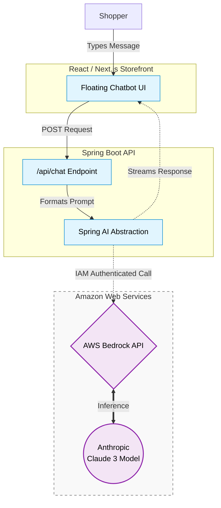

# 📦 Amazon-Like E-Commerce Platform (Phase 14: AI Customer Support Chatbot)

## 🚀 Phase 14 Overview
This branch (`phase-14-ai-chatbot`) represents the **Grand Finale** of the e-commerce platform journey. We have evolved from a basic UI deployment all the way to a completely automated, observable, FinOps-optimized Kubernetes GitOps architecture.

To cap off the application's capabilities, this phase introduces **Generative AI**. By integrating AWS Bedrock and Anthropic's Claude Foundation Model, we have built a fully interactive, context-aware Customer Support Chatbot directly into the React frontend.

### 🤖 AI Integration Architecture
1. **The LLM Backend (Spring AI & AWS Bedrock)**
   * **Technology**: Java Spring Boot, Spring AI framework, AWS Bedrock (Anthropic Claude 3 Haiku).
   * **Purpose**: Instead of making raw HTTP requests to OpenAI or AWS, the backend leverages the `spring-ai-bedrock` abstraction. This allows the backend to securely authenticate with AWS IAM roles, generate prompts, and stream responses back to the client using a clean, standardized Java API.
   * **Resilience**: The backend is configured with Spring Retry and AOP to gracefully backoff and retry inference requests if the AWS Bedrock API is throttled or temporarily unavailable.
2. **The React UI (Next.js Chat Interface)**
   * **Technology**: React, TailwindCSS, Next.js.
   * **Purpose**: A floating action button was added to the storefront UI that expands into a sleek chat window. It maintains conversation history locally and interfaces with the new `/api/chat` backend endpoint.



## 📂 Project Structure
```text
.
├── .github/workflows/             # 🐙 GitHub Actions Pipelines (DevSecOps Scans)
├── .gitlab-ci.yml                 # 🦊 GitLab CI Pipeline (Legacy UI/API Deployments)
├── Jenkinsfile                    # 🕴️ Jenkins Pipeline (GitOps Automation & SHA Tagging)
├── backend/                       # ✅ Spring Boot App 
│   ├── build.gradle               # 📦 Updated with spring-ai-bedrock dependencies
│   └── src/main/java.../chat/     # 🧠 ChatModel controllers and service abstractions
├── frontend/                      # ✅ React App 
│   └── src/components/ChatBot.tsx # 💬 New React chatbot component UI
└── ops/
    ├── helm/amazon-app/           # ☸️ Production GitOps charts
    └── ...
```

---
*Created as the Generative AI capstone for a DevOps Reference Architecture journey.*
