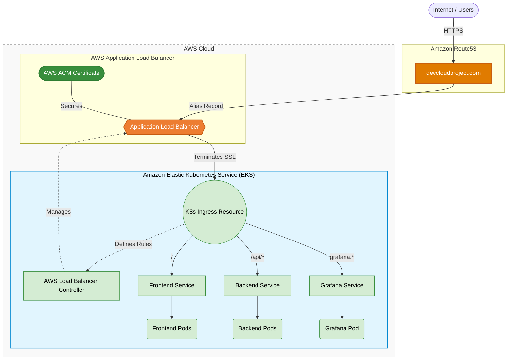

# 📦 Amazon-Like E-Commerce Platform (Phase 5: Domains & HTTPS)

## 🚀 Phase 5 Overview
This branch (`phase-5-domain`) represents the **Security and Routing** milestone of a production-grade e-commerce application. 

Building upon the EKS deployments and Observability setup from previous phases, this phase secures the application's public endpoints with **SSL/TLS encryption** using **AWS Certificate Manager (ACM)** and routes traffic via custom domains using **Amazon Route53**.

By implementing the **AWS Load Balancer Controller**, we natively bridge Kubernetes `Ingress` resources with AWS Application Load Balancers (ALB), automatically attaching provisioned SSL certificates and securely routing external internet traffic to our containerized services.

### 🏗 Ingress & Routing Architecture
*   **Infrastructure provisioning**: Terraform (Creates the ACM Certificate request).
*   **Kubernetes Ingress Controller**: AWS Load Balancer Controller.
*   **Traffic Routing**: AWS Application Load Balancer (ALB) dynamically managed by Kubernetes `Ingress`.
*   **DNS Management**: Amazon Route53.
*   **Encryption**: SSL/TLS terminated at the ALB using AWS ACM.



## 🔐 Setup & Deployment (Runbooks)

To configure your domains and secure the cluster with HTTPS, follow the Phase 5 Runbook.

1. **[Domain & HTTPS Runbook (`phase_5_walkthrough.md`)](./phase_5_walkthrough.md)**
   * Provisioning ACM Certificates with Terraform.
   * Installing the AWS Load Balancer Controller snippet.
   * Injecting the Certificate ARN into the Kubernetes `Ingress` manifest.
   * Deploying the full stack and updating Route53.
2. **[Domain Verification Tests (`phase_5_testcases.md`)](./phase_5_testcases.md)**
   * Validating SSL/TLS certificates on all public endpoints.
   * Testing routing rules across domains and subdomains.

## 📂 Project Structure
```text
.
├── backend/                  # Spring Boot application
├── frontend/                 # Next.js application
├── ops/
│   ├── k8s/
│   │   ├── ingress.yaml      # 🌐 AWS ALB Ingress Configuration (HTTPS rules)
│   │   ├── backend.yaml
│   │   ├── frontend.yaml
│   │   └── monitoring/       # Phase 4.5 Grafana/Prometheus setup
│   ├── scripts/
│   │   ├── deploy_k8s.sh            # Automated ECR Push & kubectl apply
│   │   ├── install_lb_controller.sh # Installs AWS LB Controller via Helm
│   │   └── update_ingress_cert.sh   # Fetches ACM ARN and replaces in ingress.yaml
│   └── terraform/            
│       └── aws/              # Provisioning state layer (adds ACM certificate)
├── phase_5_testcases.md      # Verification procedures for HTTPS endpoints
└── phase_5_walkthrough.md    # Master Runbook for Domains, ACM, and Routing
```

---
*Created as the Domains and HTTPS iteration for a DevOps Reference Architecture journey.*
