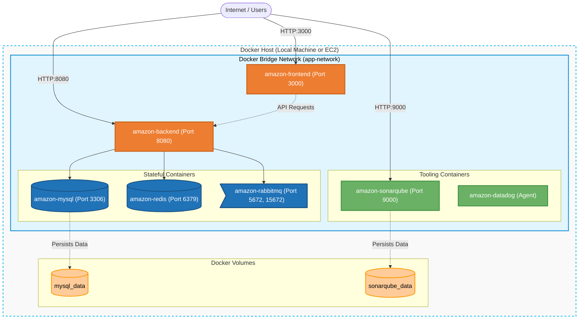

# 📦 Amazon-Like E-Commerce Platform (Phase 2: Docker & Containerization)

## 🚀 Phase 2 Overview
This branch (`phase-2-docker`) represents the **Containerization Phase** of a production-grade e-commerce application. 

Building upon the manual setups, this phase packages the entire application stack—Frontend, Backend, Databases, Message Brokers, and Observability tools—into **Docker Containers**. By using `docker-compose`, we can spin up the entire architecture locally or on a single cloud server (EC2) with a single command.

This drastically improves developer experience, ensures consistency across environments ("it works on my machine"), and serves as the foundation for Kubernetes orchestration in future phases.

### 🏗 Architecture
*   **Frontend**: Next.js 14 (React) container
*   **Backend**: Spring Boot 3.2 (Java 17) container
*   **Database**: MySQL 8.0 container (with mounted volume for data persistence)
*   **Cache**: Redis Alpine container
*   **Messaging**: RabbitMQ container
*   **Code Quality**: SonarQube container
*   **Observability**: Datadog Agent container (Metrics, APM, Logs)



## ⚡ Quick Start

### Local Development (Docker Compose)
Run the full stack locally with one command:
```bash
docker compose up -d --build
```
*   **Frontend**: [http://localhost:3000](http://localhost:3000)
*   **Backend API**: [http://localhost:8080](http://localhost:8080)
*   **SonarQube**: [http://localhost:9000](http://localhost:9000)

*(To stop the stack and remove containers: `docker compose down`)*

## 📚 Technical Playbooks & Walkthroughs

The detailed step-by-step guides for utilizing this architecture are provided below:

*   **[Phase 2 Walkthrough (`phase_2_walkthrough.md`)](./phase_2_walkthrough.md)** - Instructions on how to build, run, and troubleshoot the Dockerized stack locally or on an EC2 instance.
*   **[Test Cases (`testcases.md`)](./testcases.md)** - Verification procedures to ensure all containers, APIs, and the Datadog integration are functioning correctly.

## 📂 Project Structure
```text
.
├── backend/                  # Spring Boot Application Source Code & Dockerfile
├── frontend/                 # Next.js Application Source Code & Dockerfile
├── ops/
│   ├── docker/               # Database Initialization Scripts (e.g., init.sql)
│   ├── scripts/              # EC2 Setup Script (install Docker on Ubuntu)
│   └── vagrant/              # Vagrant configs for local VM-based testing
├── docker-compose.yml        # Orchestrates the 6 containers
├── phase_2_walkthrough.md    # Master Runbook for Docker deployment
└── testcases.md              # Infrastructure and API Verification
```

---
*Created as the Containerization iteration for a DevOps Reference Architecture journey.*
