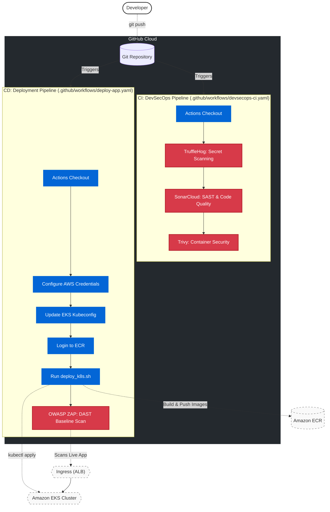

# 📦 Amazon-Like E-Commerce Platform (Phase 6a: GitHub Actions CI/CD & DevSecOps)

## 🚀 Phase 6a Overview
This branch (`phase-6a-githubactions`) represents the **Cloud-Native Continuous Integration & Continuous Deployment (CI/CD)** milestone of a production-grade e-commerce application. 

Building upon the robust AWS EKS infrastructure and secure routing established in previous phases, this phase introduces a fully automated, cloud-hosted pipeline using **GitHub Actions**. Every commit is subjected to a rigorous "Platinum" DevSecOps pipeline that automatically scans for vulnerabilities before packaging the application into Docker containers, pushing them to Elastic Container Registry (ECR), and deploying them to Kubernetes.

By embedding security checks directly into the developer workflow (Shift-Left), we ensure a highly secure, automated software supply chain.

### 🛡 DevSecOps CI/CD Architecture
*   **Pipeline Orchestration**: GitHub Actions
*   **Secret Scanning**: TruffleHog (Detects leaked API keys/credentials in commit history)
*   **Static Application Security Testing (SAST)**: SonarCloud (Analyzes code quality and bugs)
*   **Container Security**: Trivy (Scans the repository for Docker-related vulnerabilities)
*   **Dynamic Application Security Testing (DAST)**: OWASP ZAP (Scans the live deployed application)
*   **Deployment**: Automated `kubectl` applying manifests to Amazon EKS



## ⚙️ CI/CD Setup (Runbooks)

To configure the GitHub Actions pipeline secrets and trigger your automated deployments, follow the Phase 6a Runbook.

1. **[GitHub Actions Walkthrough (`phase_6a_walkthrough.md`)](./phase_6a_walkthrough.md)**
   * Creating security tokens (SonarCloud).
   * Configuring AWS IAM Credentials as GitHub Action Secrets.
   * Triggering the CI (Security) and CD (Deploy) workflows.
2. **[CI/CD Verification Tests (`phase_6a_testcases.md`)](./phase_6a_testcases.md)**
   * Validating successful workflow executions.
   * Reviewing vulnerability reports from SonarCloud and ZAP.

## 📂 Project Structure
```text
.
├── .github/
│   └── workflows/
│       ├── deploy-app.yaml       # 🚀 CD Pipeline (Build -> Push -> Deploy -> DAST)
│       └── devsecops-ci.yaml     # 🛡 CI Pipeline (TruffleHog, SonarCloud, Trivy)
├── backend/                  # Source Code 
├── frontend/                 # Source Code
├── ops/
│   ├── k8s/                  # Kubernetes Manifests
│   └── scripts/
│       └── deploy_k8s.sh     # Executed automatically by the GitHub Action
├── phase_6a_testcases.md      # Verification procedures pipeline success
└── phase_6a_walkthrough.md    # Master Runbook for setting up GitHub Actions
```

---
*Created as the Cloud-Native CI/CD iteration for a DevOps Reference Architecture journey.*
