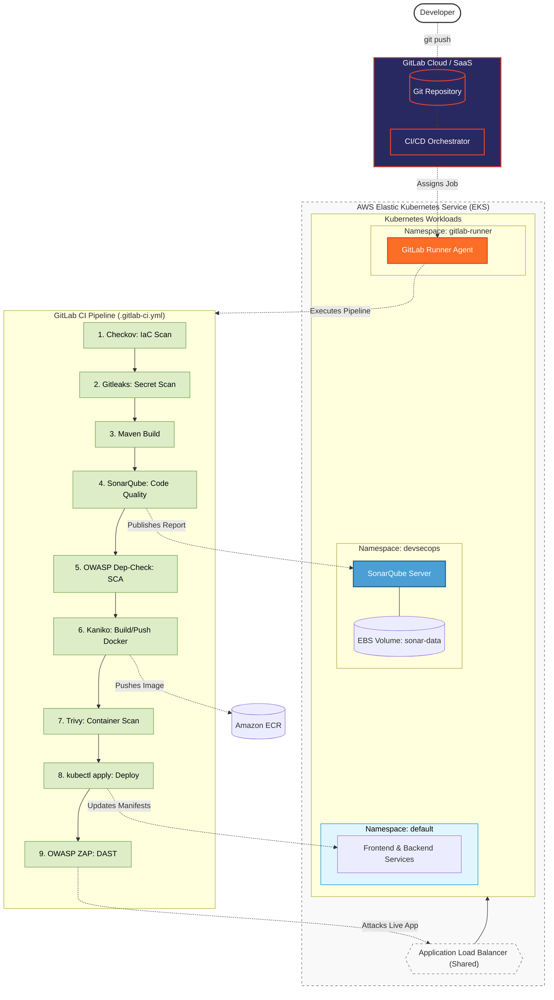

# 📦 Amazon-Like E-Commerce Platform (Phase 6c: GitLab CI & DevSecOps)

## 🚀 Phase 6c Overview
This branch (`phase-6c-gitlab`) represents the **Hybrid DevSecOps CI/CD** milestone of a production-grade e-commerce application. 

In this phase, we migrate our CI/CD strategy to leverage **GitLab CI** combined with a **Self-Hosted Kubernetes Runner**. By using GitLab's cloud-hosted UI for pipeline orchestration but executing the actual builds securely inside our own AWS EKS cluster, we achieve a highly secure, zero-queue, and cost-effective deployment engine.

Additionally, this phase introduces a self-hosted **SonarQube** server to perform deep Static Application Security Testing (SAST) and code quality gating. The comprehensive 9-stage pipeline ensures that infrastructure, secrets, dependencies, containers, and live runtime environments are all rigorously scanned before and after deployment.

### 🦊 Hybrid DevSecOps Architecture
*   **Pipeline Orchestrator**: GitLab CI (Cloud SaaS)
*   **Build Executor**: Self-Hosted GitLab Runner (Deployed in EKS)
*   **Static Application Security Testing (SAST)**: Self-Hosted SonarQube (Deployed in EKS with persistent EBS storage)
*   **Infrastructure as Code (IaC) Scanning**: Checkov
*   **Secret Scanning**: Gitleaks
*   **Software Composition Analysis (SCA)**: OWASP Dependency-Check (NVD API integrated)
*   **Container Build Engine**: Kaniko (Daemonless, unprivileged image builder)
*   **Container Security**: Trivy
*   **Dynamic Application Security Testing (DAST)**: OWASP ZAP



## 🛠 Hybrid CI/CD Setup (Runbooks)

To provision the infrastructure, register your private GitLab Runner, and execute the 9-stage pipeline, follow the Phase 6c Runbooks.

1. **[GitLab Hybrid Walkthrough (`phase_6c_walkthrough.md`)](./phase_6c_walkthrough.md)**
   * Deploying SonarQube with persistent EBS volumes.
   * Accessing SonarQube and generating quality gate tokens.
   * Registering a self-hosted GitLab Runner in EKS.
   * Configuring `.gitlab-ci.yml` pipeline variables (AWS Credentials, NVD API, Tokens).
2. **[CI/CD Verification Tests (`phase_6c_testcases.md`)](./phase_6c_testcases.md)**
   * Validating successful execution of all 9 pipeline stages.
   * Downloading and auditing job artifacts (`checkov.xml`, `gitleaks.json`, `zap.html`).

## 📂 Project Structure
```text
.
├── .gitlab-ci.yml            # 🦊 9-Stage GitLab Pipeline Definition
├── .gitleaksignore           # Git history exceptions for secret scanning
├── backend/                  # Source Code 
├── frontend/                 # Source Code
├── ops/
│   ├── k8s/                  
│   │   ├── gitlab/           # K8s Manifests (GitLab Runner Deployment, RBAC)
│   │   ├── sonarqube/        # K8s Manifests (SonarQube Deployment, PVC, Svc, Ingress)
│   │   └── ...               # App manifests
│   └── scripts/
│       └── deploy_k8s.sh     # Executed automatically by GitLab CI
├── phase_6c_testcases.md     # Verification procedures for pipeline success
└── phase_6c_walkthrough.md   # Master Runbook for Hybrid GitLab CI/CD setup
```

---
*Created as the Hybrid GitLab CI/CD iteration for a DevOps Reference Architecture journey.*
