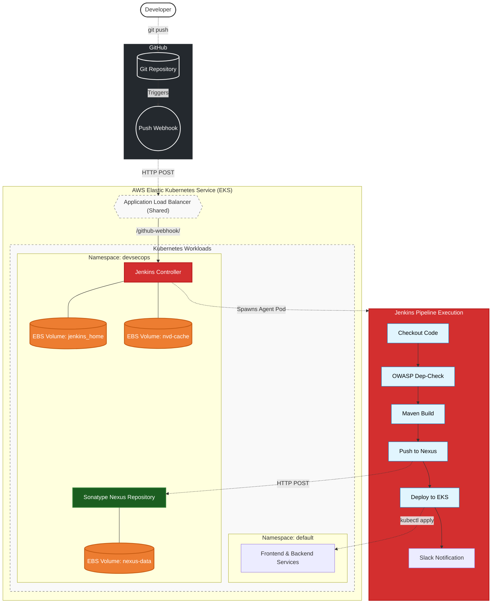

# 📦 Amazon-Like E-Commerce Platform (Phase 6b: Enterprise CI/CD & DevSecOps)

## 🚀 Phase 6b Overview
This branch (`phase-6b-jenkins`) represents the **Enterprise Self-Hosted CI/CD** milestone of a production-grade e-commerce application. 

Diverging from the cloud-native approach of Phase 6a, this phase simulates a strict enterprise environment by deploying the entire DevSecOps toolchain—including a **Jenkins** orchestration server and a **Sonatype Nexus** artifact repository—directly onto our AWS EKS cluster. 

By leveraging the AWS EBS CSI driver and dynamic volume provisioning (`gp3`), we ensure our CI/CD state is persistent and reliable. We then wire up automated GitHub Webhooks to trigger our `Jenkinsfile` pipeline, providing a secure, end-to-end continuous deployment framework that is entirely self-hosted and privately managed.

### 🏯 Enterprise DevSecOps Architecture
*   **Pipeline Orchestrator**: Self-hosted Jenkins (deployed via K8s Stateful/Deployment manifests)
*   **Artifact Repository**: Self-hosted Sonatype Nexus (Maven & Docker repositories)
*   **Persistent Storage**: AWS Elastic Block Store (EBS) managed via the EBS CSI Driver
*   **Vulnerability Scanning**: OWASP Dependency-Check (NVD API integrated)
*   **Automation Triggers**: GitHub Webhooks & SCM Polling
*   **Notifications**: Real-time Slack Webhook alerts for build statuses
*   **Ingress Routing**: Shared AWS Application Load Balancer (ALB) across App, Grafana, Jenkins, and Nexus



## 🛠 Self-Hosted Setup (Runbooks)

To provision the infrastructure and configure the Jenkins pipelines, follow the Phase 6b Runbooks.

1. **[Enterprise Setup Walkthrough (`phase_6b_walkthrough.md`)](./phase_6b_walkthrough.md)**
   * Installing the AWS EBS CSI Driver for persistent volume mounting.
   * Deploying Jenkins and Nexus to the `devsecops` namespace.
   * Unlocking the CI/CD portals and configuring Jenkins Kubernetes Cloud agents.
   * Executing the `Jenkinsfile` pipeline and configuring GitHub Webhooks.

## 📂 Project Structure
```text
.
├── Jenkinsfile               # 🏯 Jenkins Pipeline Script (Build, Scan, Deploy)
├── backend/                  # Source Code 
├── frontend/                 # Source Code
├── ops/
│   ├── k8s/                  
│   │   ├── jenkins/          # K8s Manifests (Jenkins Deployment, PVC, Svc)
│   │   ├── nexus/            # K8s Manifests (Nexus Deployment, PVC, Svc)
│   │   └── ...               # App manifests
│   └── scripts/
│       ├── install_ebs_driver.sh  # Bootstraps AWS EBS CSI Driver
│       └── deploy_k8s.sh          # Executed automatically by Jenkins
└── phase_6b_walkthrough.md   # Master Runbook for self-hosted enterprise CI/CD
```

---
*Created as the Enterprise Jenkins CI/CD iteration for a DevOps Reference Architecture journey.*
