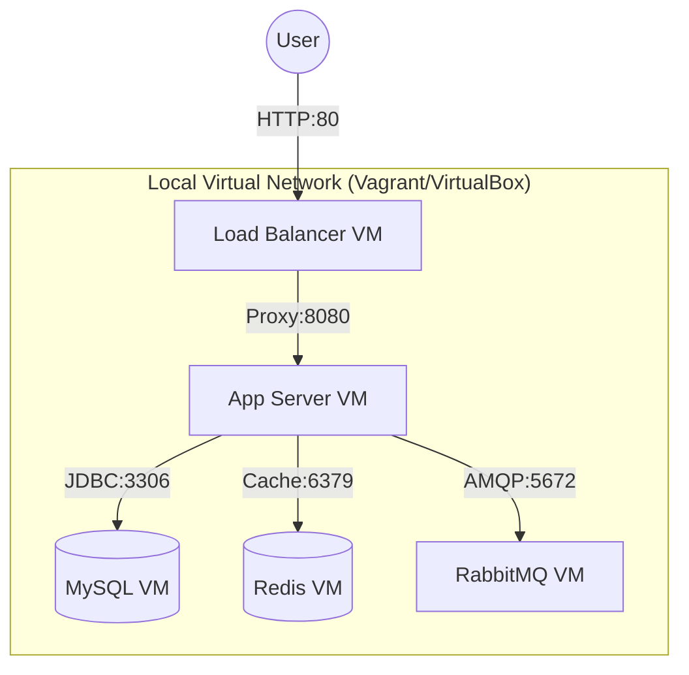
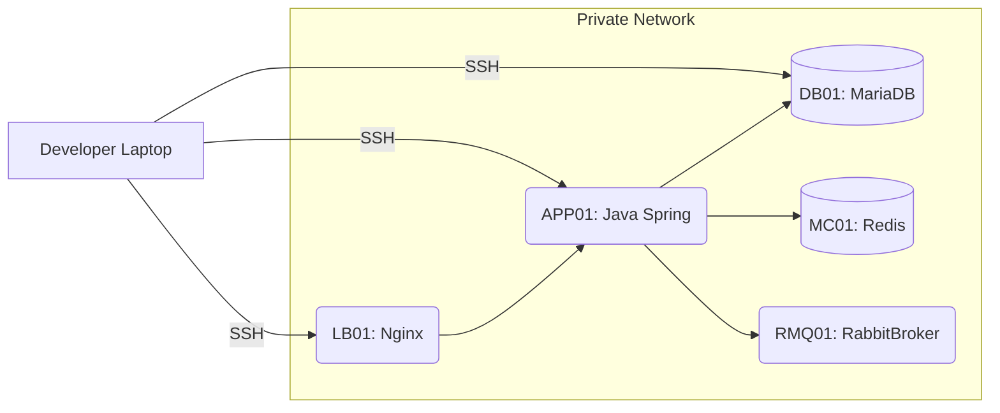
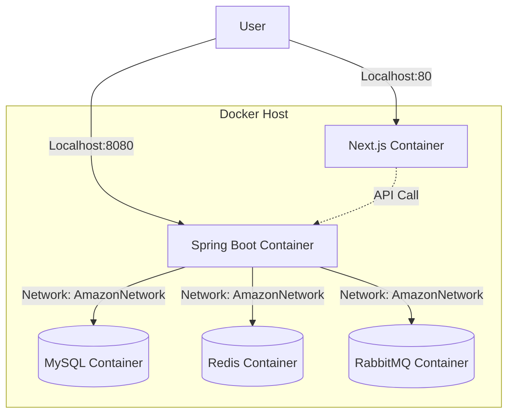
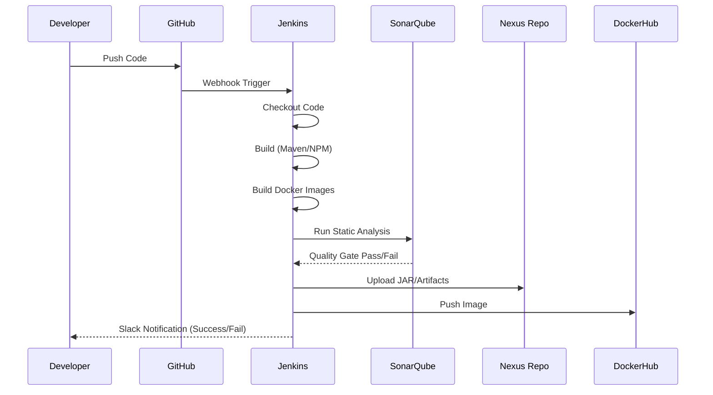
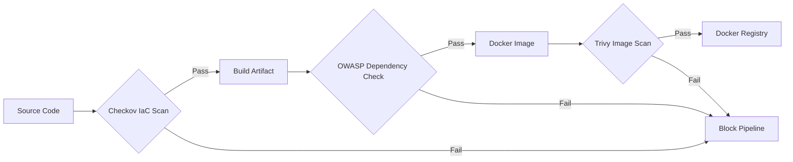
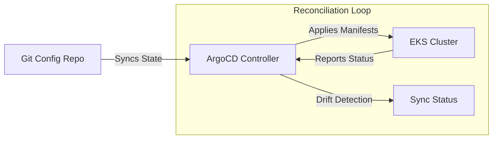
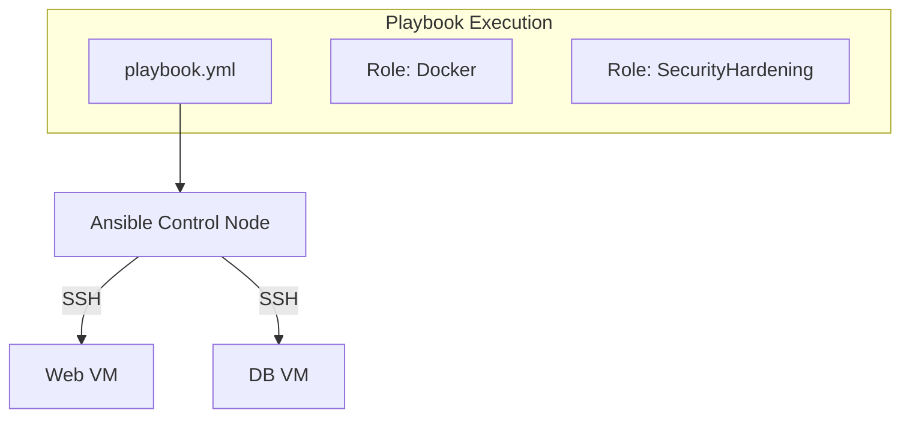
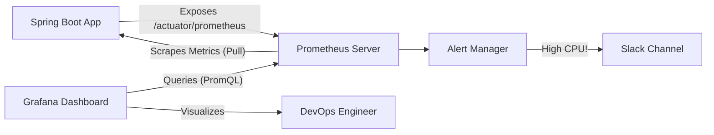

# 🎨 Project Architecture Mockups (Visual Guide)

This document contains visual diagrams for every phase of the "Amazon-Like" DevOps Project.
These diagrams illustrate the evolution of the infrastructure from local VMs to a full Cloud-Native Kubernetes cluster.

---

## 🟢 Phase 1: Manual Provisioning (Single/Multi-VM)
**Goal:** Understand the components (App, DB, Cache, Queue) by installing them manually.



---

## 🟢 Phase 1b: Enterprise Manual Setup (The VProfile Way)
**Goal:** Rigorous separation of concerns using CentOS/Enterprise Linux standards.



---

## 🔵 Phase 2: Containerization (Docker Compose)
**Goal:** Simplify setup by packaging everything into containers. No more manual `yum install`.



---

## 🟠 Phase 3: Cloud Infrastructure (AWS Terraform)
**Goal:** Replicate the network in the real cloud using Infrastructure as Code.

```mermaid
graph TB
    tf(Terraform CLI) -->|Apply| AWS
    
    subgraph "AWS Cloud (Region: us-east-1)"
        VPC[VPC]
        subgraph "Public Subnet"
            IGW[Internet Gateway]
            ALB[Application Load Balancer]
        end
        
        subgraph "Private Subnet"
            EKS[EKS Cluster (Nodes)]
            RDS[(RDS MySQL)]
            ElastiCache[(ElastiCache Redis)]
        end
    end
    
    IGW --> ALB
    ALB --> EKS
    EKS --> RDS
    EKS --> ElastiCache
```

---

## 🟣 Phase 4: CI/CD Pipeline (Jenkins)
**Goal:** Automate the build and test process.



---

## 🔒 Phase 5: DevSecOps (Security Scanning)
**Goal:** Shift security left. Catch vulnerabilities before they hit production.



---

## ☸️ Phase 6: Kubernetes Provisioning
**Goal:** Professional orchestration of containers.

```mermaid
graph TD
    Admin[Admin] -->|kubectl apply| K8s
    
    subgraph "EKS Cluster"
        Service[K8s Service (NodePort)] --> Pod1[Backend Pod 1]
        Service --> Pod2[Backend Pod 2]
        
        Pod1 --> Secret[K8s Secrets (DB Creds)]
        Pod1 --> CM[ConfigMap (Env Vars)]
        
        HPA[HPA Autoscaler] -.->|Monitors CPU| Pod1
    end
```

---

## 🔄 Phase 7: GitOps (ArgoCD)
**Goal:** The repository is the source of truth. No manual `kubectl`.



---

## ⚙️ Phase 8: Configuration Management (Ansible)
**Goal:** Managing the underlying OS configuration.



---

## 📊 Phase 9: Observability (Prometheus & Grafana)
**Goal:** Seeing what is happening inside the black box.


