# 🔄 System Architecture & Workflows

This document visualizes how the different components of the **Amazon-Like Platform** interact with each other, both during runtime (User Experience) and deployment (DevOps).

## 1. 🌐 Runtime Application Flow
How data moves when a user visits the website.

```mermaid
graph TD
    User((👤 User)) -->|HTTPS/Browser| LB[Load Balancer / Ingress]
    LB -->|Route /| Frontend[🖥️ Next.js Frontend]
    LB -->|Route /api| Backend[⚙️ Spring Boot Backend]
    
    subgraph "Kubernetes Cluster"
        Frontend -->|API Calls| Backend
        
        Backend -->|Read/Write| DB[(🛢️ MySQL Primary)]
        Backend -->|Cache Session| Redis[(⚡ Redis Cache)]
        Backend -->|Publish Order| RabbitMQ[₍📨₎ RabbitMQ]
        
        OrderService[📦 Order Worker] -->|Consume| RabbitMQ
        OrderService -->|Update Status| DB
    end

    style Frontend fill:#d4f1f9,stroke:#007185,stroke-width:2px
    style Backend fill:#e6fffa,stroke:#232f3e,stroke-width:2px
    style DB fill:#fff5f5,stroke:#ff9900,stroke-width:2px
```



### Explanation
1.  **User** hits the Load Balancer.
2.  **Frontend** serves the React UI.
3.  **Backend** handles API logic (Login, Search, Checkout).
4.  **MySQL** stores persistent data (Users, Products).
5.  **Redis** caches frequent queries and user sessions for speed.
6.  **RabbitMQ** handles orders asynchronously (so the UI doesn't freeze while processing payment).

---

## 2. 🚀 DevOps Delivery Pipeline (CI/CD)
How code moves from your laptop to production.

```mermaid
flowchart LR
    Dev((💻 Developer)) -->|Git Push| Git[GitLab / GitHub]
    
    subgraph "CI Pipeline (Jenkins/GitLab)"
        Git -->|Trigger| Build[🔨 Build & Test]
        Build -->|Scan| Security[🛡️ Trivy/SonarQube]
        Security -->|Pass| Docker[🐳 Docker Build]
        Docker -->|Push| Registry[📦 Nexus / Container Registry]
    end
    
    subgraph "CD Pipeline (GitOps)"
        Registry -->|Update Tag| Helm[Helm Chart Repo]
        ArgoCD[🐙 ArgoCD] -->|Watch| Helm
        ArgoCD -->|Sync| K8s{☸️ Kubernetes Cluster}
    end

    style ArgoCD fill:#ffcfd3,stroke:#ff0000
    style K8s fill:#d6eaff,stroke:#326ce5
```



### Explanation
1.  **Code Commit**: Developer pushes changes.
2.  **Build & Test**: Jenkins compiles Java/Node.js and runs Unit Tests.
3.  **Security Gate**: SonarQube checks code quality; Trivy checks for vulnerabilities.
4.  **Artifact**: If safe, a Docker Image is built and pushed to the Registry.
5.  **Deployment**: ArgoCD detects the new image version in the Helm Chart and automatically updates the Kubernetes Cluster.

---

## 3. 📊 Observability & Monitoring Flow
How we see what is happening inside the cluster.

```mermaid
graph LR
    subgraph "Kubernetes Nodes"
        App[📱 Application Pods]
        Node[💻 Node Metrics]
    end

    subgraph "Monitoring Stack"
        Prometheus[🔥 Prometheus]
        Grafana[📈 Grafana]
        Datadog[🐶 Datadog Agent]
    end

    App -->|Expose /actuator/prometheus| Prometheus
    Node -->|Expose /metrics| Prometheus
    Prometheus -->|Pull (Scrape)| App
    
    Grafana -->|Query (PromQL)| Prometheus
    
    App -->|Logs & Traces| Datadog
    Datadog -->|Push HTTPS| Cloud[☁️ Datadog Cloud]

    style Prometheus fill:#e6522c,stroke:#333,color:white
    style Grafana fill:#F46800,stroke:#333
    style Datadog fill:#632CA6,stroke:#333,color:white
```

### Explanation
1.  **Prometheus**: "Scrapes" (pulls) numerical metrics from the Spring Boot App (via Actuator) and Kubernetes Nodes every 15 seconds.
2.  **Grafana**: Connects to Prometheus to visualize these numbers in Dashboards (e.g., "Requests per Second", "CPU Usage").
3.  **Datadog Agent**: Runs on every node (DaemonSet), intercepts logs and APM traces, and pushes them securely to the Datadog Cloud for analysis.
